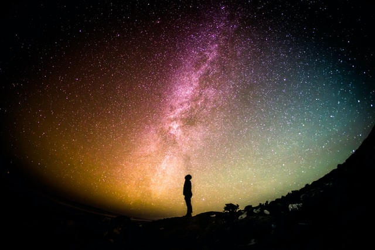

# ATOM

:satellite: An application to make you discover some amazing images from the NASA data

  <kbd>
    </img>
  </kbd>

&nbsp;

## Technologies Used

✔️ 100% JS Vanilla\
✔️ 100% CSS Vanilla\
✔️ NODE\
✔️ EXPRESS\
✔️ JS PARTICLES

&nbsp;

:satisfied: 

## Library
 <a href="https://vincentgarreau.com/particles.js/">A lightweight JavaScript library for creating particles</a>

&nbsp;

## API
 <a href="https://api.nasa.gov/">The NASA API portal</a>
